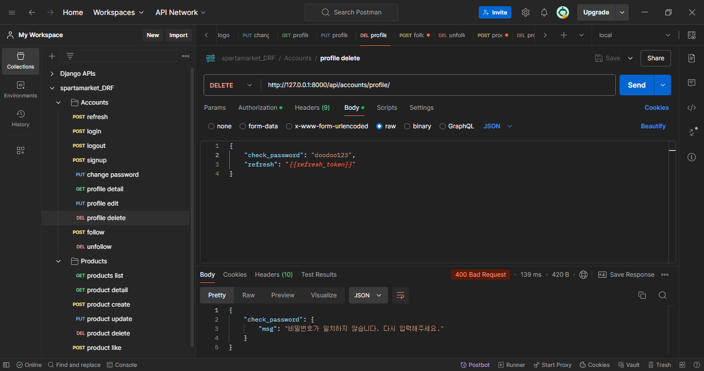
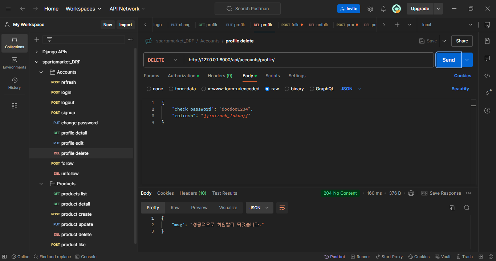

# django_drf_private

## Introduction
- Projectname : spartamarket drf
- Build shoping mall back-end with using django-DRF
 
## Contributors
- Seungju Yi
- Yeonjae Park(readme reference)

## Duration
- 2024.08.28 ~ Now

## TechStack
- Back-End
  -  3.10.11
- framework
  -  4.2
- database
  -


## Installation
1. Clone the repo
```
git clone https://github.com/github_username/repo_name.git
```
2. Install pip packages
```
pip install -r requirements.txt
```
3. check settings.py
```
SECRET_KEY = "enter SECRET_KEY"
DEBUG = env("DEBUG")
```

## Architecture
- erd


- project architecture
```
📦 
├─ .gitignore
├─ README.md
├─ accounts
│  ├─ __init__.py
│  ├─ admin.py
│  ├─ apps.py
│  ├─ migrations
│  ├─ models.py
│  ├─ permissions.py
│  ├─ serializers.py
│  ├─ tests.py
│  ├─ urls.py
│  ├─ validators.py
│  └─ views.py
├─ manage.py
├─ products
│  ├─ __init__.py
│  ├─ admin.py
│  ├─ apps.py
│  ├─ migrations
│  ├─ models.py
│  ├─ paginations.py
│  ├─ permissions.py
│  ├─ serializers.py
│  ├─ tests.py
│  ├─ urls.py
│  └─ views.py
├─ requirements.txt
└─ spartamarket_DRF
   ├─ __init__.py
   ├─ asgi.py
   ├─ settings.py
   ├─ urls.py
   └─ wsgi.py
```
©generated by [Project Tree Generator](https://woochanleee.github.io/project-tree-generator)


## How to use
### accounts
  <details>
    <summary>signup</summary>
    <div markdown="1">

   - endpoint : api/accounts/
   - method : POST
   - input in body
     - Required: username, password, email, name, nickname, birthday
     - Optional: sex(choice: M, W, N(default)), introduce
   - access
     - Over 15 years old can signup

   case1: signup_sucess
   
   
   case2: username validation fail
   

   case3: email validation fail
   

   case4: birthday validation fail
   

   </div>
  </details>
  

  <details>
    <summary>login</summary>
    <div markdown="1">

   - endpoint : api/accounts/login/
   - method : POST
   - input in body
     - Required: password

  
    </div>
  </details>
  

  <details>
    <summary>logout</summary>
    <div markdown="1">

   - Endpoint : api/accounts/logout/
   - method : POST
   - input in header
     - Required: access_token
   - input in body
     - Required: No need

   

   </div>
  </details>
  

  <details>
    <summary>refresh</summary>
    <div markdown="1">

    - Endpoint : api/accounts/refresh/
    - method : POST
    - input in header
      - Required: access_token
    - input in body
      - Required: refresh(it means refresh_token)

  
      
   </div>
  </details>


  <details>
    <summary>profile detail inquiry</summary>
    <div markdown="1">

   - Endpoint : api/accounts/profile/&#60;str:username>/
   - method : GET
   - input in header
     - Required: access_token
   - input in body
     - Required: No need

  case1:
  

      
   </div>
  </details>


  <details>
    <summary>profile update</summary>
    <div markdown="1">

   - Endpoint : api/accounts/profile/&#60;str:username>/
   - method : PUT
   - input in header
     - Required: access_token
   - input in body
     - Optional: email, name, nickname, birthday, sex(choice:M, W, N(default)), introduce 
   - access
     - Owner only


  case1: Not owner
  

  case2: validation fail
  

  case3: sucess
  
      
    </div>
  </details>


  <details>
    <summary>profile delete</summary>
    <div markdown="1">

   - Endpoint : api/accounts/profile/
   - method : DELETE
   - input in header
     - Required: access_token
   - input in body
     - Required: password, refresh(means refresh_token)
   - access
     - Owner only

  case1: fail 1 
  

  case2: fail 2
  
  
  case3: sucess
  
      
   </div>
  </details>


  <details>
    <summary>password change</summary>
    <div markdown="1">

   - Endpoint : api/accounts/password/
   - method : PUT
   - input in header
     - Required: access_token
   - input in body
     - Required: old_password, password1, password2 (password1 and password2 mean new password you want to set)
   - access
     - Owner only

  case1: new password validation fail1
  

  case2: new password validation fail2
  

  case3: old password validation fail
  

  case4: sucess
  
      
   </div>
  </details>


  <details>
    <summary>follow</summary>
    <div markdown="1">

   - Endpoint : api/accounts/follow/&#60;str:username>/
   - method : POST
   - input in header
     - Required: access_token
   - input in body
     - Required: No need
   - access
     - Owner only

  case1: already followed
  

  case2: can't follow self
  

  case3: sucess
  
      
   </div>
  </details>


  <details>
    <summary>unfollow</summary>
    <div markdown="1">

   - Endpoint : api/accounts/follow/&#60;str:username>/
   - method : DELETE
   - input in header
     - Required: access_token
   - input in body
     - Required: No need
   - access
     - Owner only

   case1: didn't follow
   

   case2: can't unfollow self
   

   case3: sucess
   
     
   </div>
  </details>


### product

  <details>
    <summary>product registration</summary>
    <div markdown="1">

   - endpoint : api/products/
   - method : POST
   - input in header
     - Required: access_token
   - input in body
     - Required: title, content
     - Optional: image

   

   </div>
  </details>


  <details>
    <summary>product list inquiry</summary>
    <div markdown="1">

   - endpoint : api/products/list/
   - method : GET
   - input in header
     - Required: No need
   - input in body
     - Required: No need

   

   -additional features
     -pagenation
       - There are 10 products on one page, and the page number is entered through query string. ex -> end of url add "?page=2"
       

     -filtering
       - It can be filtered by title, content, and the search term is passed through query string
       

   </div>
  </details>
  

  <details>
    <summary>product detail inquiry</summary>
    <div markdown="1">

   - endpoint : /api/products/&#60;int:productID>
   - method : GET
   - input in header
     - Required: access_token
   - input in body
     - Required: No need

   

   </div>
  </details>


  <details>
    <summary>product update</summary>
    <div markdown="1">

   - endpoint : /api/products/&#60;int:productID>
   - method : PUT
   - input in header
     - Required: access_token
   - input in body
     - Required: title, content
     - Optional: image, tags
   - access
     - Owner only

   case1: Not owner
   

   case2: sucess
   

   </div>
  </details>


  <details>
    <summary>product delete</summary>
    <div markdown="1">

   - endpoint : /api/products/&#60;int:productID>
   - method : DELETE
   - input in header
     - Required: access_token
   - input in body
     - Required: No need
   - access
     - Owner only

   case1: Not Owner
   

   case2: sucess
   

   </div>
  </details>


  <details>
    <summary>product like</summary>
    <div markdown="1">

   - endpoint : /api/products/&#60;int:productID>/like/
   - method : POST
   - input in header
     - Required: access_token
   - input in body
     - Required: No need
   - access
     - Owner only

   case1: Not Owner
   

   case2: sucess
   

   </div>
  </details>


  <details>
    <summary>product like cancel</summary>/like/
    <div markdown="1">

   - endpoint : /api/products/&#60;int:productID>
   - method : DELETE
   - input in header
     - Required: access_token
   - input in body
     - Required: No need
   - access
     - Owner only

   case1: Not Owner
   

   case2: sucess
   

   </div>
  </details>
